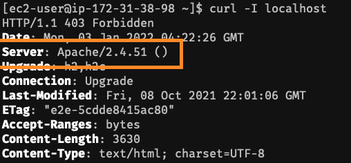
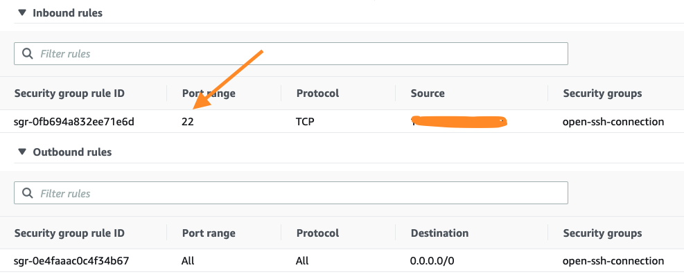
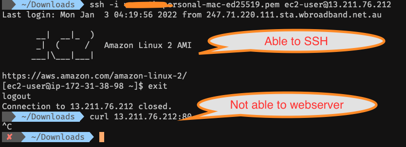
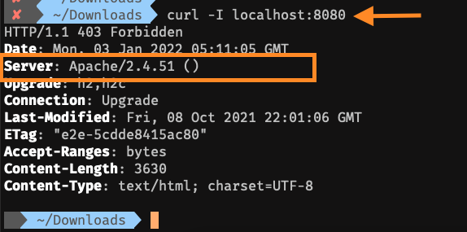

# Welcome to Productivity Page

In this Productivity page - I will be documenting the simple tips and tricks useful in your work and daily life. 

## Tunneling via SSH

SSH tunneling (a.k.a SSH portforwarding) is a powerful way to bypass firewall to establish networking connections. In this example, I am going to demonstrate the Local Tunneling and Remote (Reverse) Tunneling.

### Local Tunneling

Local Tunneling enables the connection from client machine to Target Machine via SSH connection.

Apache running on Server



Security Groups(Firewall) not having access to port 80



Not able to access via Client Machine


Command to enable local portforwarding

In this below example tunneling connection to Port 80 on the server and access the webserver from Port 8080
```
ssh -i <SSHKey.pem> -L 8080:localhost:80 ec2-user@13.211.76.212
```
`-L` enables Local Port Forwarding 

