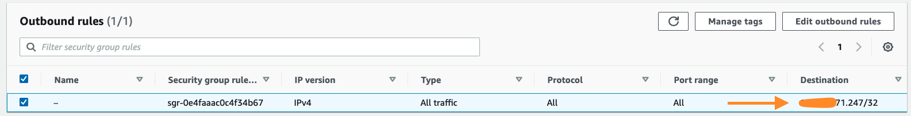
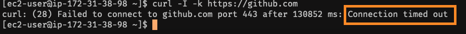
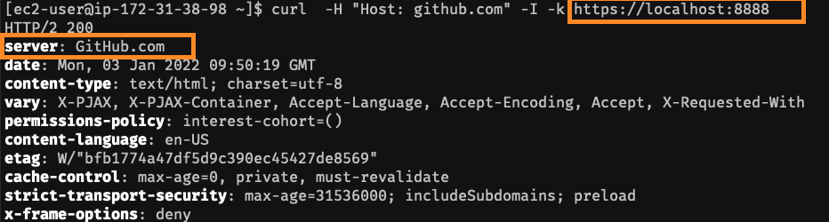

# Welcome to Productivity Page

In this Productivity page - I will be documenting the simple tips and tricks useful in your work and daily life. 

## Tunneling via SSH

SSH tunneling (a.k.a SSH portforwarding) is a powerful way to bypass firewall to establish networking connections. In this example, I am going to demonstrate the Local Tunneling and Remote (Reverse) Tunneling.

### Local Tunneling (a.ka. Local Port Forwarding)

Local Tunneling enables the connection from client machine to Target Machine via SSH connection.

Apache running on Server


Security Groups(Firewall) not having access to port 80


Not able to access via Client Machine


Command to enable local portforwarding

In this below example tunneling connection to Port 80 on the server and access the webserver from Port 8080
```
ssh -i <SSHKey.pem> -L 8080:localhost:80 ec2-user@13.211.76.212
```
`-L` enables Local Port Forwarding 


### Remote Tunneling (a.k.a Remote Port Forwarding)

Remote Port Forwarding establishes connection via client machine. Its useful in some cases where the client have access to website but server is blocked and its common scenario on enterprise world where all the connections from the server traverses via Outbound Proxy where most of the sites are blocked for security concerns.

Security Groups(Firewall) all outbound connections allowed only to client machine ( In corporate it must be your proxy servers)


```
ssh -i <SSHKEY>.pem -R 8888:github.com:443 ec2-user@13.211.76.212
```

Acccessing the github website directly from server - Access not allowed (Stuck in that case)


Accessing using remote Tunneling

`-R` enables the Remote Forwarding

There might be case you may want to edit the sshd config (/etc/ssh/sshd_config) for the remote port forwarding to work

```
#AllowTcpForwarding yes
#GatewayPorts yes
```

Reference :  `https://www.ssh.com/academy/ssh/tunneling/example`